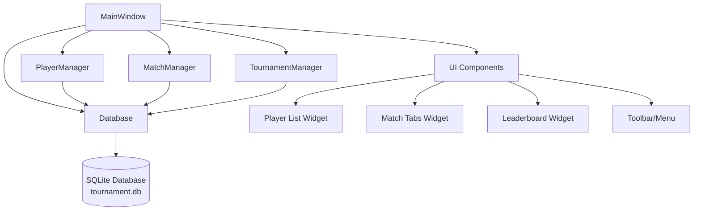
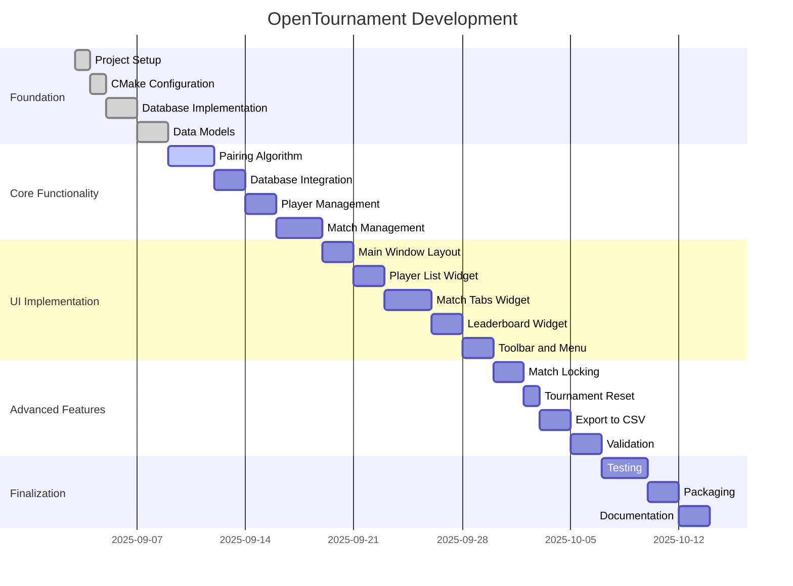

# OpenTournament Project Plan

## Project Overview

OpenTournament is a desktop application for managing tournament brackets using a round-robin pairing system. It will be built using Qt6 and CMake with SQLite for data persistence.

## Architecture Diagram



## Component Breakdown

### 1. Core Components

#### MainWindow

- Main application window
- Contains all UI elements
- Manages interactions between components

#### Database

- SQLite database integration
- Handles all data persistence
- Manages connections and queries

#### Data Models

- Player model
- Match model
- Tournament model

#### Managers

- PlayerManager: Handles player operations
- MatchManager: Handles match operations
- TournamentManager: Handles tournament operations

### 2. UI Components

#### Player Management

- Add/edit/remove players
- Display player list
- Validate player names

#### Match Management

- Generate round-robin pairings
- Display matches in tabbed layout
- Submit match results
- Lock/unlock match results

#### Leaderboard

- Display ranked players
- Calculate points and standings
- Update in real-time

#### Toolbar/Menu

- New Tournament
- Export Results
- Exit

## Implementation Steps

### Phase 1: Foundation

1. Set up project structure
2. Create CMakeLists.txt
3. Implement database schema
4. Create core data models

### Phase 2: Core Functionality

1. Implement round-robin pairing algorithm
2. Create database integration
3. Implement player management
4. Implement match management

### Phase 3: UI Implementation

1. Design main window layout
2. Implement player list widget
3. Implement match tabs widget
4. Implement leaderboard widget
5. Add toolbar and menu

### Phase 4: Advanced Features

1. Implement match locking mechanism
2. Add tournament reset functionality
3. Implement export to CSV
4. Add validation and error handling

### Phase 5: Finalization

1. Testing
2. Packaging
3. Documentation

## File Structure

```
OpenTournament/
├── CMakeLists.txt
├── src/
│   ├── main.cpp
│   ├── MainWindow.cpp
│   ├── MainWindow.h
│   ├── Database.cpp
│   ├── Database.h
│   ├── Player.cpp
│   ├── Player.h
│   ├── Match.cpp
│   ├── Match.h
│   ├── Tournament.cpp
│   └── Tournament.h
├── resources/
└── tournament.db
```

## Technology Stack

- **Language**: C++
- **Framework**: Qt6
- **Build System**: CMake
- **Database**: SQLite
- **UI**: Qt Widgets

## Development Timeline



## Testing Checklist

- [ ] Add players and verify uniqueness
- [ ] Generate pairings for even/odd counts
- [ ] Submit results, confirm locks
- [ ] Unlock/edit and verify update
- [ ] Export CSV and verify correctness
- [ ] Reset tournament clears DB

## Future Extensions

- Swiss system pairing
- Elo rating updates
- Online sync via WebSockets
- Native window style with QML/QtQuick
